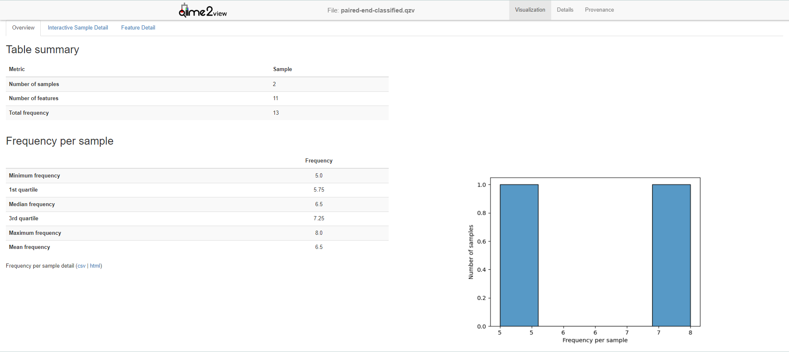

# q2-mOTUs
This is a QIIME 2 wrapper for [mOTU-tool](https://motu-tool.org/). The tool will help you to assign taxonomy to your metagenomic samples. 
For details on QIIME 2, see https://qiime2.org. 

# Requirements
- QIIME 2 >= 2022.8 (https://qiime2.org/)
- Git

# Known issues
QIIME2 makes the copy of sampling data to a temporary directory. By default, it's located in the `/tmp/` folder, which may not have enough space to store the data. Please, change the `TMPDIR` variable to the folder with enough space.
```
export TMPDIR=/path/to/tmpdir
```

# Installation
## 1. Install QIIME 2
Follow the instructions on https://docs.qiime2.org/2022.8/install/native/ to install QIIME 2. You will need to install the latest version of QIIME 2 (2022.8 or later).
## 2. Activate QIIME 2
Activate the QIIME 2 environment by running the following command:
```
conda activate qiime2-2022.8
```
## 3. Install mOTU-tool
```
git clone https://github.com/motu-tool/q2-mOTUs
cd q2-mOTUs
make install
```

# Usage

The plugin executes one function - assigns taxonomy to metagenomic reads. Therefore, there is a single workflow.
## 1. Import your data to QIIME 2
Import your metagenomic sequencing data in `.fastq` format (don't forget to preprocess your data) to QIIME2 as a `SampleData` semantic type using manifest file. See examples in [`q2_motus/tests/data`](https://github.com/motu-tool/q2-mOTUs/tree/main/q2_motus/tests/data).
## 2. Run mOTU-tool
Whether you have a single sample or multiple samples, you can run mOTU-tool using the following command:
```
qiime motus profile \
    --i-samples paired-end.qza \
    --o-taxonomy paired-end-taxonomy.qza \
    --o-table paired-end-classified.qza \
    --p-threads 4 \
    --p-jobs 2
```

## Optionaly, you can import precomputed, merged mOTU profiles
**Attention**: precomupted mOTU table should be generated from full taxonomy `-q` flag and counts `-c` flag profiles. 

``` 
qiime motus import_table \
--i-motus-table $TMPDIR/merged.motus \
--o-table artifacts/motu-table.qza \
--o-taxonomy artifacts/motu-taxonomy.qza
```

## Output 
1. `table` - `FeatureTable[Frequency]` - A table of the counts of gene markers in samples.
2. `taxonomy` - `FeatureData[Taxonomy]` -  A full taxonomy for each of the gene marker.

## 3. Process the results
Because `table` is a `FeatureTable[Frequency]` artifact, QIIME2 offers a lot of possibilities to analyze it. For example, use `feature-table summarize`:
```
qiime feature-table summarize \
    --i-table paired-end-classified.qza \
    --o-visualization paired-end-classified.qzv
```
To get summary of your feature table.



Or create all-time favourite taxa barplot:
```
qiime taxa barplot \
    --i-table paired-end-classified.qza \
    --i-taxonomy paired-end-taxonomy.qza \
    --o-visualization paired-end-taxa-barplot.qzv
```


Or analyze the samples using `Metadata` you have on hand!

# Citation
If you use this tool, please cite the following paper:
```
@article{Ruscheweyh2022,
  doi = {10.1186/s40168-022-01410-z},
  url = {https://doi.org/10.1186/s40168-022-01410-z},
  year = {2022},
  month = dec,
  publisher = {Springer Science and Business Media {LLC}},
  volume = {10},
  number = {1},
  author = {Hans-Joachim Ruscheweyh and Alessio Milanese and Lucas Paoli and 
            Nicolai Karcher and Quentin Clayssen and Marisa Isabell Keller and 
            Jakob Wirbel and Peer Bork and Daniel R. Mende and Georg Zeller and 
            Shinichi Sunagawa},
  title = {Cultivation-independent genomes greatly expand taxonomic-profiling 
           capabilities of {mOTUs} across various environments},
  journal = {Microbiome}
}
```